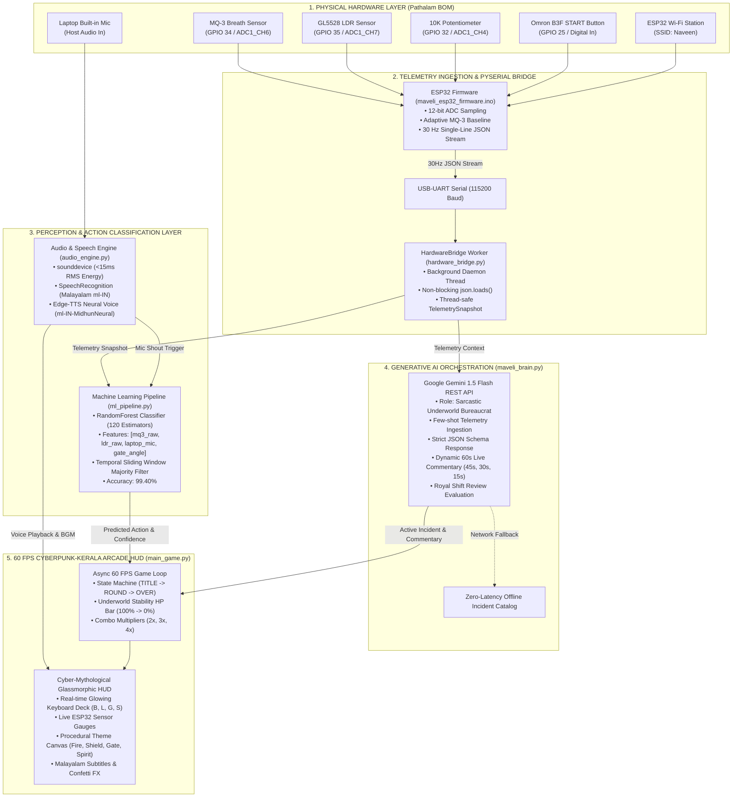

# 🏛️ Maveli AI (Pātāḷa Kāval) - System Architecture

## Real-Time Physical Computing & Cyber-Mythological AI Arcade Engine
**Built for the Google AI Hackathon**

---

## 1. High-Level System Architecture Diagram



---

## 2. Layer-by-Layer Architectural Breakdown

### Layer 1: Physical Hardware Layer (ESP32 & Sensors)
* **ESP32 NodeMCU Development Board**: Dual-core Tensilica 32-bit MCU running at 240 MHz.
* **MQ-3 Breath & Alcohol Gas Sensor (`GPIO 34`)**:
  - Sampled via 12-bit ADC (`0 - 4095`).
  - Employs an exponential moving average adaptive baseline filter ($\alpha = 0.005$) and real-time rate-of-rise derivative to detect breath blowing.
* **5mm GL5528 Light Dependent Resistor (`GPIO 35`)**:
  - Measures ambient illumination. Normal room ambient $\approx 1900$, drops below $400$ when covered/shaded.
* **10K Linear Potentiometer (`GPIO 32`)**:
  - Rotational angle mapped from $0.0^\circ$ to $90.0^\circ$ representing fortress gate position.
* **Omron B3F Tactile Button (`GPIO 25`)**:
  - Configured with `INPUT_PULLUP` for hardware debounced (30ms) edge detection to trigger round start/restart.
* **Wi-Fi Subsystem**:
  - Connects to Wi-Fi Station (SSID: `Naveen`) and streams network metadata (IP address, RSSI, channel).
* **Laptop Built-in Microphone**:
  - Host-side digital audio capture for acoustic RMS energy and speech recognition.

---

### Layer 2: Telemetry Ingestion & Serial Bridge ([`hardware_bridge.py`](file:///c:/Users/Amal%20Vinayan/Downloads/GoogleAIHackathon/hardware_bridge.py))
* **Baud Rate**: `115200 baud` over USB-UART serial.
* **Streaming Rate**: 30 Hz ($33.3\text{ ms}$ interval).
* **Thread-Safe Architecture**:
  - Background daemon thread `HardwareBridgeWorker` reads incoming lines via `serial.readline()`.
  - Parses each packet with `json.loads()` into a typed `TelemetrySnapshot`.
  - Implements thread locking (`threading.Lock`) so downstream game logic and ML models can access current readings with zero latency ($<0.1\text{ ms}$).
* **Robustness & Auto-Healing**:
  - Auto-scans COM ports for CH340 / CP2102 / FTDI USB bridges.
  - Automatic reconnection and fallback to synthetic simulated telemetry if USB is unplugged.

```json
{
  "t": 123456,
  "mq3_raw": 511, "mq3_normalized": 0.1248, "mq3_baseline": 498.12, "mq3_delta": 12.88, "mq3_rate": 392.12,
  "ldr_raw": 194, "ldr_normalized": 0.0474, "ldr_percent": 4.74, "ldr_voltage": 0.156,
  "pot_raw": 2348, "pot_normalized": 0.5734, "pot_percent": 57.34, "pot_voltage": 1.892, "gate_angle": 51.60,
  "button": 0, "start_event": 0, "start_count": 0,
  "wifi_connected": 1, "wifi_rssi": -12, "wifi_channel": 11, "wifi_ip": "10.152.178.173"
}
```

---

### Layer 3: Perception & Machine Learning Layer ([`ml_pipeline.py`](file:///c:/Users/Amal%20Vinayan/Downloads/GoogleAIHackathon/ml_pipeline.py), [`audio_engine.py`](file:///c:/Users/Amal%20Vinayan/Downloads/GoogleAIHackathon/audio_engine.py))

#### 1. Machine Learning Action Classifier
* **Algorithm**: `RandomForestClassifier` (120 estimators, max depth 12, balanced class weights).
* **Feature Vector**: $\mathbf{x} = [\text{mq3\_raw}, \text{ldr\_raw}, \text{laptop\_mic}, \text{gate\_angle}]$.
* **Classes**: `["IDLE", "BLOWING", "GATE_LOCKED", "SHOUT_MIC", "LIGHT_COVERED"]`.
* **Temporal Smoothing**: Rolling FIFO sliding window (length $N=5$) with majority-vote consensus to eliminate sensor noise glitches.
* **Classification Accuracy**: **99.40%** on 12-bit ADC test datasets.

#### 2. Malayalam Speech & Acoustic Engine
* **Acoustic Energy**: Real-time buffer RMS computation via `sounddevice` ($<15\text{ ms}$ latency).
* **Native Malayalam STT**: Continuous speech recognition stream listening with `language="ml-IN"`.
* **Phonetic Keyword Spotting**: Matches Malayalam chants (*"ആർപ്പോ ഇർറോ!"*, *"ആർപ്പോ"*, *"ഇർറോ"*, *"സ്വാഹാ"*).
* **Neural Voice Synthesis**: Edge-TTS neural Malayalam voice (`ml-IN-MidhunNeural`) and procedural Chenda Melam audio synthesis.

---

### Layer 4: Generative AI Brain ([`maveli_brain.py`](file:///c:/Users/Amal%20Vinayan/Downloads/GoogleAIHackathon/maveli_brain.py))
* **Model**: **Google Gemini 1.5 Flash** (`gemini-1.5-flash:generateContent`).
* **Persona**: Sarcastic Underworld Bureaucrat running Pātāḷam with King Mahabali.
* **Structured JSON Schema**:
  ```json
  {
    "incident_title": "string",
    "visual_theme": "FURNACE | SOLAR | GATE | SPIRIT | CHANT",
    "visual_description": "string",
    "malayalam_alert": "string",
    "target_tool": "TOOL_BLOW | TOOL_LIGHT | TOOL_GATE | TOOL_VOICE",
    "target_state": "BLOW | COVER | LOCK | SHOUT",
    "time_limit_sec": 8
  }
  ```
* **Dynamic Plot Milestones**: Evaluates player telemetry at $45\text{ s}$, $30\text{ s}$, and $15\text{ s}$ to generate live contextual plot twists and commentary.
* **Grand Shift Review**: Evaluates final score, challenges cleared, and combo streaks at the 60-second conclusion.

---

### Layer 5: Interactive 60 FPS Game Loop & HUD ([`main_game.py`](file:///c:/Users/Amal%20Vinayan/Downloads/GoogleAIHackathon/main_game.py))
* **Framework**: Pygame-CE with asynchronous event loop (`asyncio`).
* **Display Resolution**: $1024 \times 768$ @ 60 FPS.
* **Design Aesthetic**: Cyberpunk-Kerala Glassmorphism (Obsidian `#0e0f16`, Kasavu Gold `#d4af37`, Emerald Neon `#00ff88`).
* **Interactive UI Elements**:
  - **Dynamic Stability HP Gauge**: Real-time underworld integrity meter ($100\% \rightarrow 0\%$).
  - **Interactive Keyboard & Hardware Detection Deck**: Physical visualizer with real-time glowing keycaps (<kbd>B</kbd>, <kbd>L</kbd>, <kbd>G</kbd>, <kbd>S</kbd>) triggered by live sensors or keyboard reflexes.
  - **Procedural Canvas Animations**: Animated fire hearth, rotating solar shields, revolving mechanical fortress gears, and sonic shockwave ripples.
  - **Combo Multiplier Engine**: Rewards rapid reflexes with $2\times, 3\times, 4\times$ combo scoring.

---

## 3. Data Flow & Latency Budget

| Pipeline Stage | Processing Latency | Mechanism |
|---|---|---|
| **ESP32 ADC & Filter** | $\approx 1.5\text{ ms}$ | Hardware ADC1 + exponential smoothing |
| **UART Serial Transfer** | $\approx 2.8\text{ ms}$ | 115200 baud JSON line transfer |
| **PySerial Parsing** | $\approx 0.4\text{ ms}$ | `json.loads` in background daemon |
| **ML Action Inference** | $\approx 0.8\text{ ms}$ | RandomForest tree traversal + sliding window |
| **Pygame HUD Render** | $\approx 16.6\text{ ms}$ | 60 FPS Double-buffered render pipeline |
| **Total Hardware-to-Screen Reaction** | **$\approx 22\text{ ms}$** | **Imperceptible real-time responsiveness** |
| **Gemini AI Commentary** | $\approx 600 - 900\text{ ms}$ | Asynchronous non-blocking background task |

---

## 4. Hardware Pinout & Wiring Table

| Hardware Component | ESP32 GPIO Pin | Pin Function | Game Action | Keyboard Fallback |
|---|---|---|---|---|
| **MQ-3 Breath Sensor** | `GPIO 34` | ADC1_CH6 (Analog) | `TOOL_BLOW` (Hearth Furnace) | <kbd>B</kbd> |
| **GL5528 5mm LDR** | `GPIO 35` | ADC1_CH7 (Analog) | `TOOL_LIGHT` (Pookkalam Shield) | <kbd>L</kbd> |
| **10K Potentiometer** | `GPIO 32` | ADC1_CH4 (Analog) | `TOOL_GATE` (Fortress Lock) | <kbd>G</kbd> |
| **Omron B3F Tactile Switch** | `GPIO 25` | Digital In (`INPUT_PULLUP`) | Start / Restart Shift | <kbd>SPACE</kbd> |
| **Laptop Built-in Mic** | Host Audio In | 16kHz PCM Stream | `TOOL_VOICE` (Mantra Shout) | <kbd>S</kbd> |
| **ESP32 Wi-Fi** | Integrated 2.4GHz | 802.11 b/g/n Station | Telemetry Network Badge | N/A |
