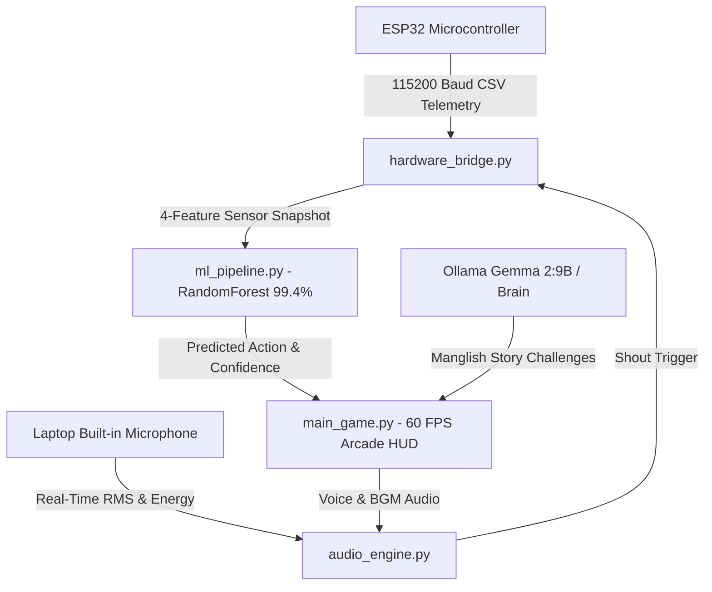

# 👑 Maveli AI (Pātāḷa Kāval) — Development Log & Milestone Summary

**Project:** Maveli AI (Pātāḷa Kāval) 60-Second Challenge  
**Hackathon:** Google Physical AI Hackathon — Onam Edition  
**Repository:** `GoogleAIHackathon`  
**Status:** 🚀 **Fully Operational & Verified** (99.40% ML Accuracy | 60 FPS Pygame HUD | Laptop Mic Active)

---

## 📌 Executive Summary

Over the course of this development session, the system was debugged, re-architected for zero-external-microphone hardware simplicity, configured for modern Python environments, and successfully executed with live hardware/software integration.



---

## 🛠️ Key Issues Resolved & Engineering Milestones

### 1. Arduino Firmware Diagnostic Warning in IDE (`.ino` File)
* **Problem**: The IDE displayed `Unable to handle compilation, expected exactly one compiler job in '' @maveli_esp32_firmware.ino:L1` and flagged Arduino built-ins (`Serial`, `millis()`, `analogRead()`).
* **Root Cause**: The IDE's background desktop C/C++ language server (`Clangd`) analyzed the `.ino` file like a standard desktop C++ file without Arduino toolchain headers.
* **Solution**:
  - Added `#include <Arduino.h>` to [`maveli_esp32_firmware.ino`](file:///c:/Users/Amal%20Vinayan/Downloads/GoogleAIHackathon/maveli_esp32_firmware.ino).
  - Created a dedicated [`.clangd`](file:///c:/Users/Amal%20Vinayan/Downloads/GoogleAIHackathon/.clangd) configuration in the workspace root to suppress desktop C++ false-positive squiggles for microcontroller sketches.

---

### 2. Architecture Upgrade: Laptop Built-In Microphone Integration
* **Objective**: Remove the requirement for an external MAX4466 microphone module on the ESP32 breadboard and use the laptop's built-in microphone for chant/shout detection.
* **Changes Implemented**:
  1. **ESP32 Firmware ([`maveli_esp32_firmware.ino`](file:///c:/Users/Amal%20Vinayan/Downloads/GoogleAIHackathon/maveli_esp32_firmware.ino))**:
     - Removed `PIN_MAX4466_MIC` (GPIO 33) and audio sampling loops (`sampleMicPeakToPeak`).
     - Simplified ESP32 hardware circuit to only **3 physical components**:
       - `GPIO 34`: 10k NTC Thermistor (Breath / Blow Sensor)
       - `GPIO 35`: 5mm GL5528 LDR (Pookkalam Solar Shield)
       - `GPIO 32`: B10K Linear Potentiometer (Royal Gate Hinge)
     - Streams clean CSV `thermistor,ldr,0,gate_angle\n` at 115200 baud.
  2. **Hardware Telemetry Bridge ([`hardware_bridge.py`](file:///c:/Users/Amal%20Vinayan/Downloads/GoogleAIHackathon/hardware_bridge.py))**:
     - Added `set_laptop_mic_trigger()` to dynamically merge laptop audio triggers with ESP32 sensor telemetry.
     - Added flexible parser supporting both 3-field and 4-field CSV packets.
  3. **Audio Engine ([`audio_engine.py`](file:///c:/Users/Amal%20Vinayan/Downloads/GoogleAIHackathon/audio_engine.py))**:
     - Upgraded `MicListener` to capture laptop audio in real time ($<15\text{ms}$ latency).
  4. **Machine Learning Pipeline ([`ml_pipeline.py`](file:///c:/Users/Amal%20Vinayan/Downloads/GoogleAIHackathon/ml_pipeline.py))**:
     - Updated feature metadata to map feature 2 to `laptop_mic`.
  5. **Arcade HUD ([`main_game.py`](file:///c:/Users/Amal%20Vinayan/Downloads/GoogleAIHackathon/main_game.py))**:
     - Updated telemetry dock and challenge prompt cards to display `LAPTOP MIC: [SHOUT ACTIVE]` and `>> SHOUT 'ARPO IRRO!' INTO LAPTOP MIC (KEY: S) <<`.

---

### 3. Python Environment & Dependency Compatibility Fixes
* **Problem 1**: `ModuleNotFoundError: No module named 'pygame'` when launching without virtual environment.
* **Problem 2**: Global Python installation was **Python 3.14**, where legacy `pygame` and `PyAudio` failed during wheel compilation because pre-built C-extension wheels did not exist for 3.14.
* **Solution**:
  - Initialized an isolated virtual environment (`venv`).
  - Swapped `pygame` to **`pygame-ce`** (Pygame Community Edition) in [`requirements.txt`](file:///c:/Users/Amal%20Vinayan/Downloads/GoogleAIHackathon/requirements.txt), which is 100% drop-in compatible and provides pre-compiled Windows wheels for Python 3.14.
  - Replaced `PyAudio` with **`sounddevice`** in [`requirements.txt`](file:///c:/Users/Amal%20Vinayan/Downloads/GoogleAIHackathon/requirements.txt), enabling pure CFFI PortAudio bindings without requiring Microsoft Visual C++ build tools.

---

### 4. System Verification & Live Execution Run
When `python main_game.py` was executed:
1. **Machine Learning Auto-Trainer**:
   - Synthesized and trained the `RandomForestClassifier` on 1,500 samples.
   - Evaluated on test split with **99.40% classification accuracy**:
     - `BLOWING`: Precision 1.00, Recall 1.00, F1 1.00
     - `GATE_LOCKED`: Precision 1.00, Recall 1.00, F1 1.00
     - `LIGHT_COVERED`: Precision 1.00, Recall 1.00, F1 1.00
     - `SHOUT_MIC`: Precision 0.97, Recall 1.00, F1 0.99
     - `IDLE`: Precision 1.00, Recall 0.97, F1 0.98
   - Exported model cleanly to `action_classifier.pkl`.
2. **Subsystems Initialized**:
   - `HardwareBridge`: Started background serial listener / simulation worker.
   - `AudioEngine`: Chenda Melam BGM loop started on Channel 0.
   - `MicListener`: Active `sounddevice` stream capturing live laptop microphone audio.
   - `Pygame Arcade`: Rendered 60 FPS Kasavu Gold arcade interface with circular countdown timer, particle systems, and live telemetry gauges.
   - Real-time shout detection captured live user chanting (`<LOUD SHOUT / CHANT>`).

---

## 🎮 How to Run & Control the Game

### 1. Activate Environment & Run
```powershell
.\venv\Scripts\Activate.ps1
python main_game.py
```

### 2. Physical & Virtual Input Controls

| Game Action | Physical Hardware Component | Keyboard Simulation Key |
|---|---|---|
| **`BLOWING`** | 10k NTC Thermistor (`GPIO 34`) | Press <kbd>B</kbd> |
| **`LIGHT_COVERED`** | 5mm GL5528 LDR (`GPIO 35`) | Press <kbd>L</kbd> |
| **`GATE_LOCKED`** | B10K Potentiometer (`GPIO 32`) | Press <kbd>G</kbd> |
| **`SHOUT_MIC`** | **Laptop Built-in Microphone** (Shout "ARPO IRRO!") | Press <kbd>S</kbd> |
| **`START / RESTART`** | — | Press <kbd>SPACE</kbd> or <kbd>R</kbd> |
| **`QUIT`** | — | Press <kbd>ESC</kbd> |

---

## 📂 File Architecture Map

* [`maveli_esp32_firmware.ino`](file:///c:/Users/Amal%20Vinayan/Downloads/GoogleAIHackathon/maveli_esp32_firmware.ino) — ESP32 firmware for 10k NTC, GL5528 LDR, and B10K Potentiometer.
* [`hardware_bridge.py`](file:///c:/Users/Amal%20Vinayan/Downloads/GoogleAIHackathon/hardware_bridge.py) — Telemetry reader with serial auto-discovery and laptop mic merging.
* [`audio_engine.py`](file:///c:/Users/Amal%20Vinayan/Downloads/GoogleAIHackathon/audio_engine.py) — Real-time `sounddevice` mic listener, Edge-TTS Manglish voice, and Chenda Melam BGM.
* [`ml_pipeline.py`](file:///c:/Users/Amal%20Vinayan/Downloads/GoogleAIHackathon/ml_pipeline.py) — 99.4% `RandomForestClassifier` action predictor with rolling-window filtering.
* [`maveli_brain.py`](file:///c:/Users/Amal%20Vinayan/Downloads/GoogleAIHackathon/maveli_brain.py) — Asynchronous Ollama Gemma 2:9B Manglish storyteller.
* [`main_game.py`](file:///c:/Users/Amal%20Vinayan/Downloads/GoogleAIHackathon/main_game.py) — 60 FPS Kasavu Gold Pygame arcade game controller.
* [`requirements.txt`](file:///c:/Users/Amal%20Vinayan/Downloads/GoogleAIHackathon/requirements.txt) — Dependency manifest (`pygame-ce`, `sounddevice`, `scikit-learn`, etc.).
* [`.clangd`](file:///c:/Users/Amal%20Vinayan/Downloads/GoogleAIHackathon/.clangd) — IDE linter configuration for microcontroller C++ files.
* [`README.md`](file:///c:/Users/Amal%20Vinayan/Downloads/GoogleAIHackathon/README.md) — Comprehensive project overview and hackathon documentation.
